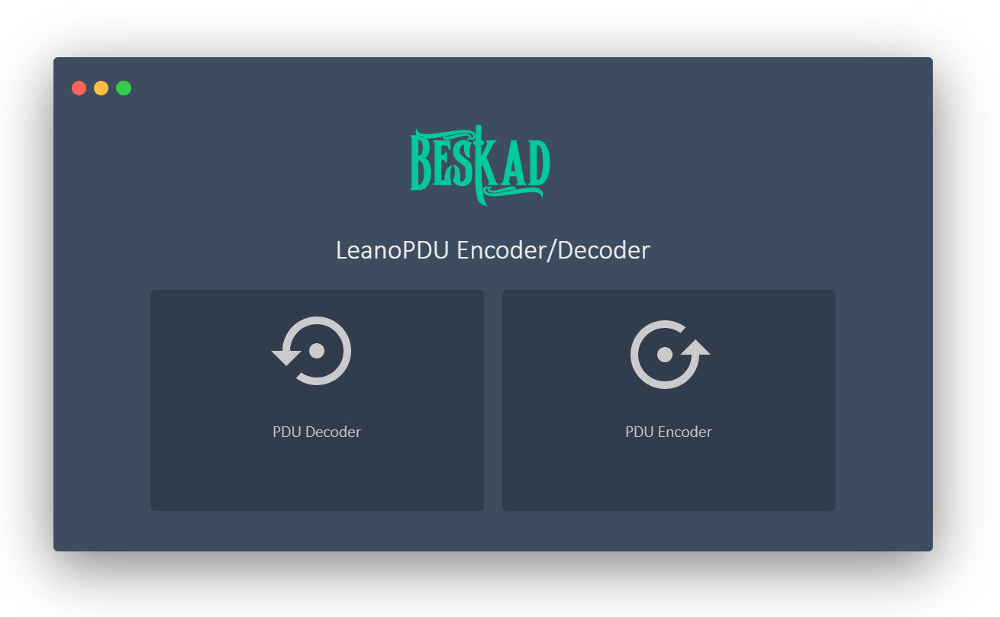

# leanoPDUSMS
PDU management/encode/decode tool and management receiving/sending SMS from GSM/LTE/5G modules

I thought to myself, why not create this project with the most basic tools?!

## How it work

### Server side

The functions file can be used on the web server or as a contains user binaries

It is possible to send the execution of functions as POST and call from CLI

##### change_to_pdu

This function sets the preferred storage of the module on the SIM card and also sets the SMS receiving mode to the PDU.

By executing this function once, AT commands are sent to the module

`change_to_pdu <AT_device_name>`

##### creat_sms_list

This function saves a list of received sms on a file called smslist

in order and numbered

`creat_sms_list <AT_device_name> <0 OR 1 for delete all SMS After save>`

##### json_sms_pdu_list

This function displays all received sms messages stored in the smslist file in JSON format

`json_sms_pdu_list`


Sample JSON output:
```json
{
  "lenghtt": "7",
  "ID1": "L1",
  "DATA1": "06918919015000400C918919025296760008322070808483418C0500031C04020627062F0627064606CC002006A906470020064606330628062A0020062806470020062F06310645062706460020062E0648062F002006270642062F062706450020064606A906460646062F00200648002006AF06480627064706CC0020062A062D062A0020062F063106450627064600200646062F06270634062A06470020062806270634",
  "ID2": "L2",
  "DATA2": "06918919015000400C918919025296760008322070808473418C0500031C0401064506350631064100200647063106AF0648064606470020064506480627062F00200645062E062F06310020064800200631064806270646002006AF0631062F062706460020062C063106450020064506CC0020062806270634062F0020064800200628063100200627063306270633002006420627064606480646060C002006450639062A",
  "ID3": "L3",
  "DATA3": "06918919015000400C918919025296760008322070808483418C0500031C04030646062F00200645062C06310645002006280648062F06470020064800200645064506A90646002006270633062A002006280647002006340634002006450627064700200627064206270645062A0020062F0631002006450631062706A906320020064806CC069806470020064606AF0647062F0627063106CC002006450639062A0627062F",
  "ID4": "L4",
  "DATA4": "0791893905809012440ED04979D83D2EB3D90008322070514521418C050003FA060106450634062A063106A9002006AF06310627064506CC000A06AF0648063406CC00200634064506270020064206270628064406CC062A0020062F063106CC06270641062A0020062A0646063806CC06450627062A0020062E0648062F06A9062706310020062706CC0646062A06310646062A00200631062700200646062F06270631062F060C",
  "ID5": "L5",
  "DATA5": "0791893905809012440ED04979D83D2EB3D90008322070514521418C050003FA06020020062C0647062A0020062F063106CC06270641062A0020062A0646063806CC06450627062A0020062F0633062A06CC0020062706CC0646062A06310646062A002006AF0648063406CC0020062E0648062F060C0020064506CC0020062A06480627064606CC062F002006A9062F0020062F0633062A0648063106CC0020002A003500350035",
  "ID6": "L6",
  "DATA6": "0791893905809012440ED04979D83D2EB3D90008322070514521418C050003FA060400610062006C006500200074006F002000720065006300650069007600650020006100750074006F006D006100740069006300200049006E007400650072006E00650074002000730065007400740069006E00670073002E00200050006C00650061007300650020006400690061006C0020002A003500350035002A0034002A0034002A0031",
  "ID7": "L7",
  "DATA7": "0791893905809012440ED04979D83D2EB3D900083220705145214114050003FA0606006E00750061006C006C0079002E"
}
```

### PDU Encoder/Decoder Side
This section, developed with JS, allows to manage PDU encryption and decryption in web.
##### PDU Decoder

Just send the PDU to the pduDecoder function
It will give you a JSON response including the sender, date and time, concatenated message (if the SMS is multi-part) and SMS text.

`pduDecoder("PDU-CODE")`

Sample returned answer:
```json
 ['989120256967', '2023-02-07 08:48:38 GMT +3.5', 'Concatenated message: reference number 28, part 2 of 4 parts', 'ادانی که نسبت به درمان خود اقدام نکنند و گواهی تحت درمان نداشته باش']
```
##### PDU Encoder


This function provides the possibility of making the sent message as a PDU
An output from the PDU string and AT COMMAND will give you the length of the PDU string

`stringToPDU(inpString, phoneNumber, smscNumber, size, mclass, valid, receipt,vFlag)`


inpString : Message text

phoneNumber: The number to which the message is sent

smscNumber : short message service center

size :  7 / 8 / 16 bit

mclass : Message Class > none / 0 / 1/ 2 /3

TODO ( valid, receipt,vFlag Compilition )

Sample returned answer:

`{"ATCMD":"AT+CMGS=23","PDU":"0001000C9189190252967600000A00730061006C0061006D"}`


### Simple Test



